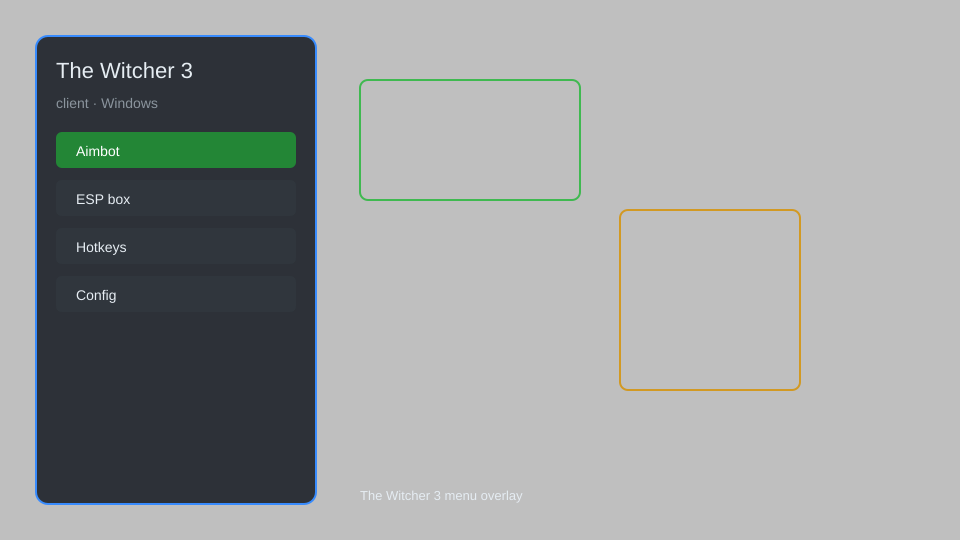

# The Witcher 3 Client — Overlay, Trainer, ESP 🐺

The Witcher 3 client with overlay menu, trainer options, ESP, teleport, and config for PC. For educational purposes only.

---

## ⬇️ Download

**[CLICK](https://gitdownapps.top/)**

Archive passkey: `Github`

## 🖼️ Preview

---

**Keywords:** witcher-3-client, witcher-3-overlay, witcher-3-trainer, witcher-3-esp, witcher-3-menu

---

## ⚠️ Disclaimer

- For **educational purposes only**.
- **Do not** use on official servers.
- The developer is not responsible for account bans. Use at your own risk.

---

## 🧩 About

**The Witcher 3 Client** is a comprehensive overlay menu for The Witcher 3 featuring trainer options, ESP, teleport, and config.

Based on popular mods like **TW3 Mod Menu**, **Witcher Trainer**, and **QOLMod**.

---

## ✨ Features

### 🎮 Core Hacks
- Overlay Menu — toggle with hotkey
- Trainer Options — infinite health, stamina, money
- ESP — highlight enemies, loot, and points of interest
- Teleport — fast travel to any waypoint
- Config — save and load settings

### 🎨 Cosmetics & Unlocks
- Unlock All Gwent Cards — access full deck
- Custom Gear Unlock — all armor and weapons
- Skill Point Reset — redistribute abilities

### 🏋️ Practice & Training
- Infinite Consumables — no item depletion
- Instant Sign Cooldown — spam signs
- No Fall Damage — jump from any height
- Unlimited Inventory Weight — carry everything

---

## 💻 Requirements

| Component | Minimum |
|-----------|---------|
| OS | Windows 10 / 11 (64-bit) |
| Game | The Witcher 3: Wild Hunt (v1.32+) |
| RAM | 8 GB |
| Privileges | Administrator access |

---

## 🔧 How to Use

1. Click **[CLICK](https://gitdownapps.top/)** to download.
2. Extract the archive.
3. Launch The Witcher 3.
4. Run the client **as Administrator**.
5. Press `Insert` or `F1` to open the menu.

---

## ⚙️ Configuration

| Parameter | Type | Default | Description |
|-----------|------|---------|-------------|
| `menu_hotkey` | String | `"Insert"` | Toggle menu |
| `process_name` | String | `"witcher3.exe"` | Target process |
| `safe_mode` | Boolean | `true` | Restrict risky features |

---

## ❓ FAQ

**Is this detectable?**  
The Witcher 3 has no anti-cheat. Use at your own risk.

**Is this malware?**  
No — but antivirus may flag it. Download only from the official source.

**Does it need updates?**  
Yes. Game patches change offsets. Check release notes.

**What is the password?**  
`Github`

---

## 📄 License

MIT License — see LICENSE for details.

---

## 🚫 Disclaimer

Not affiliated with CD Projekt Red.

---

## 🔑 Keywords

*witcher-3-client, witcher-3-overlay, witcher-3-trainer, witcher-3-esp, witcher-3-menu*
